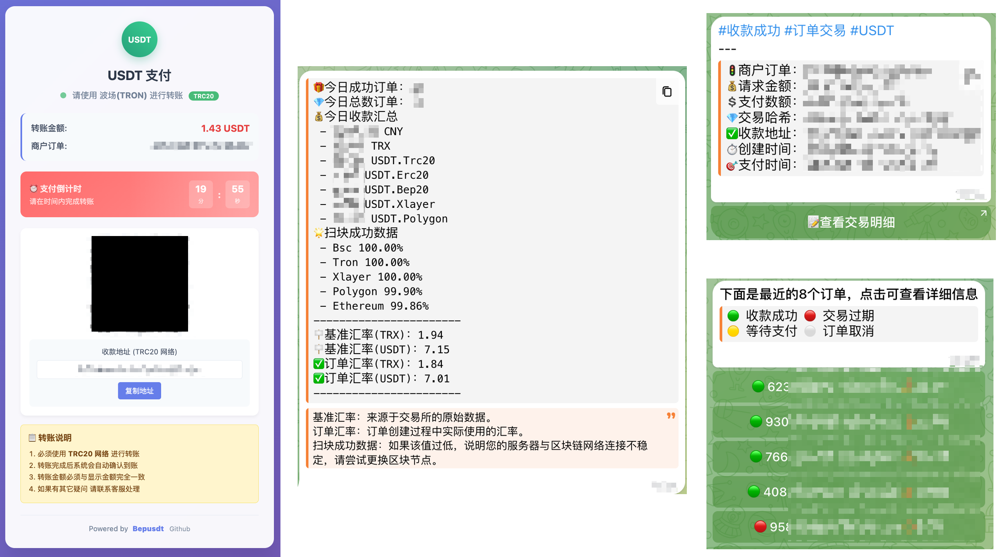

**❗️作者声明：本项目为研究学习区块链的开源项目，不提供任何形式的收费服务(谨防诈骗)，不鼓励任何衍生金融属性的交易行为，不负责任何使用本项目进行的三方行为；使用过程中遇见问题请提`issue`
或群里交流，开源项目请自重！**

---

# BEpusdt (Better Easy Payment USDT)

## 🪧 介绍

基本就是对`Epusdt`重新造了一次轮子，移除一些非必要依赖(`Redis MySQL`)，同时加入一些新特性，让个人`USDT/USDC`
收款更好用、部署更便捷！

## 🎉 新特性

### 🌟 目前支持收款网络

🔥 主流网络：TRON Ethereum BSC Polygon 
⚡ 其他网络： X-Layer Solana Aptos Arbitrum-One Base [完整列表](./docs/trade-type.md)

- ✅ 完全兼容 `Epusdt`，插件无缝替换
- ️✅ 区块网络支持`USDT USDC`收款监控
- ✅ 实时同步`USDT`汇率，支持自定义浮动
- ✅ 无`MySQL Redis`依赖，支持`Docker`部署
- ✅ 支持非订单交易监控，钱包余额变动通知
- ✅ 支持自定义`USDT`支付精度与递增颗粒度
- ✅ 底层区块扫描，无`API`依赖，秒级响应
- ✅ 支持波场能量代理与能量回收监控
- ✅ 原生兼容`易支付`收单接口，快捷接入
- ✅ 支持创建订单 自定义钱包地址 超时
- ✅ 完整支持`等待支付 支付超时`回调
- ✅ 支持事件`WebHook` 方便多方协同
- 🏖️ 摆脱TG依赖 完整WEB后台管理 待实现

## 🚀 安装部署

- 安装：[Docker](./docs/docker.md)・[Linux](./docs/systemd.md)・[1Panel](./docs/1panel/README.md)・[宝塔](./docs/bt_panel/README.md)
- 对接：[独角数卡](./docs/dujiaoka.md)・[异次元](./docs/acg-faka.md)・[萌次元](./docs/mcy-shop.md)・[彩虹易支付](https://github.com/v03413/Epay-BEpusdt)
- 开发：[API对接](./docs/api.md)・[订单回调](./docs/notify-epusdt.md)・[Webhook 事件](./docs/webhook.md)
- 其它：[https 配置](./docs/ssl.md)・[时钟同步](./docs/systemd-timesyncd.md)・[模板修改](./docs/template/README.md)・[参数配置](./conf.example.toml)

## 🖼 功能截图

## 🤔 常见问题

- [如何获取参数 admin_id](./docs/faq/admin_id.md)
- [服务器宽带占用过大解释](./docs/faq/bandwidth.md)

## ⚠️ 特别注意

- 订单交易强依赖时间，请确保服务器时间准确性，否则可能导致订单异常！
- 部分功能依赖网络，请确保服务器网络纯洁性，否则可能导致功能异常！

## 🏝️ 交流反馈

- Telegram 群组：[https://t.me/BEpusdtChat](https://t.me/BEpusdtChat)
- Telegram 频道：[https://t.me/BEpusdtChannel](https://t.me/BEpusdtChannel)

## 🙏 感谢

- https://github.com/assimon/epusdt

## 📢 声明

- 本项目仅供个人学习研究使用，任何人或组织在使用过程中请符合当地的法律法规，否则产生的任何后果责任自负。

## 🌟 Stargazers over time

