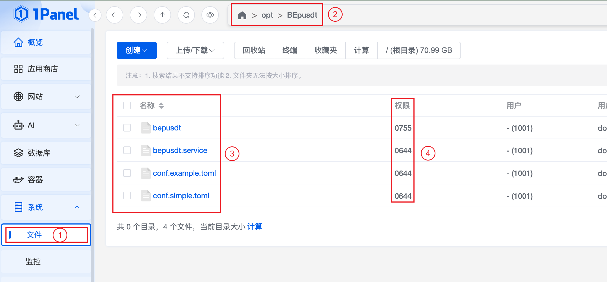
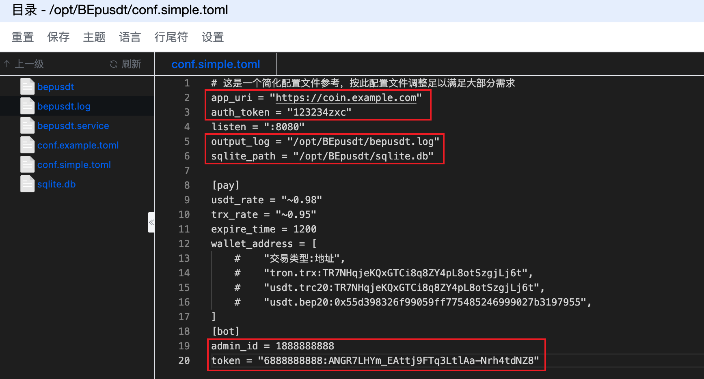
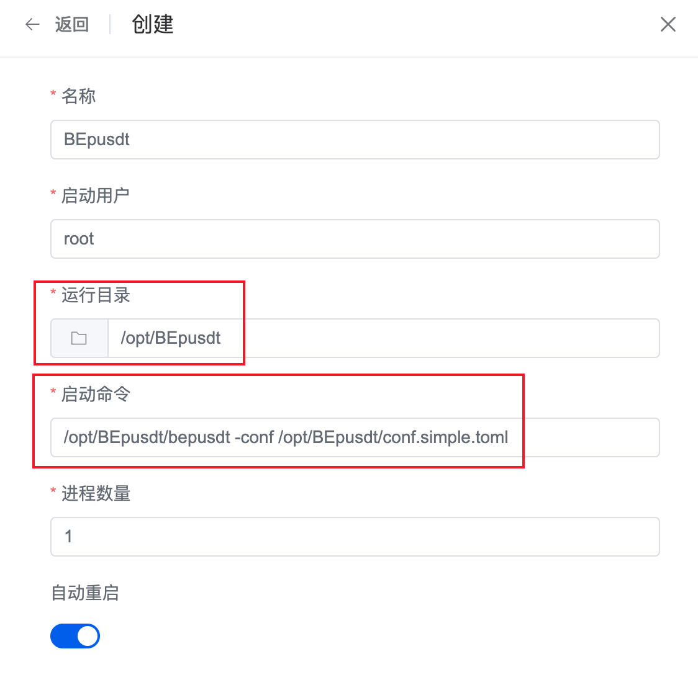
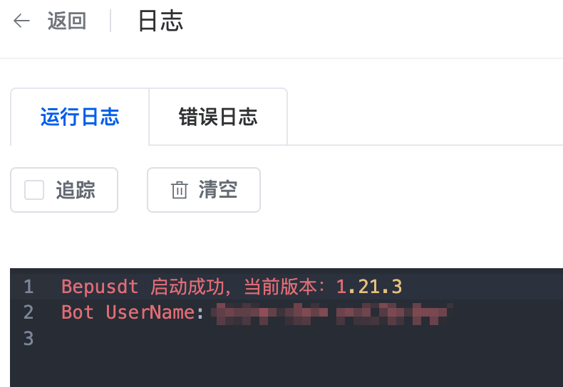
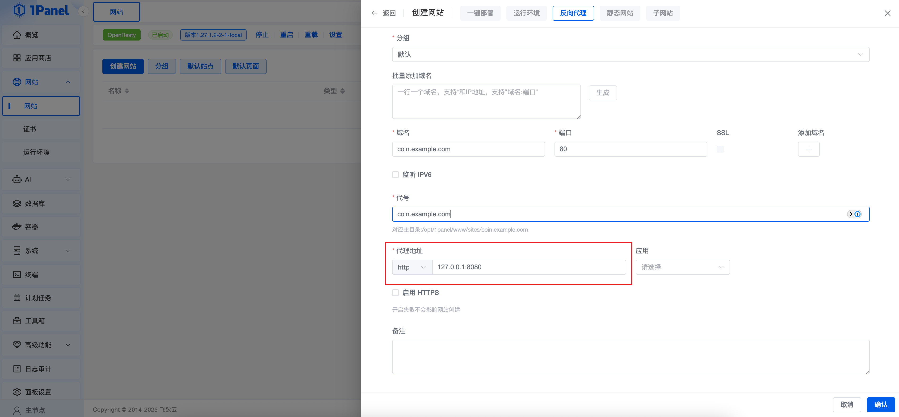

# 1Panel部署BEpusdt教程

部署有两种方式，本文采用`1Panel`配合`进程守护`进行部署，另一种方式是[配合Docker容器部署](./docker.md)，自行选择。

PS：默认认为你已经安装好`1Panel`，并且能够正常使用。

## 配置文件准备

最新发行版文件：https://github.com/v03413/BEpusdt/releases/latest/download/linux-amd64-BEpusdt.tar.gz  
下载文件后解压，全部内容上传到服务器的 `/opt/BEpusdt` 目录下(没有则自行创建)，确保你的目录结构和权限和下图一致：



打开配置文件`conf.simple.toml`进行调整，红框所示内容为必改项，其他内容按需调整：



日志和数据路径配置：

```toml
output_log = "/opt/BEpusdt/bepusdt.log"
sqlite_path = "/opt/BEpusdt/sqlite.db"
```

填写信息无误后确认保存。

## 创建进程守护

返回`1Panel`首页，依次点击左侧`工具箱` -> `进程守护`(如果提示未安装`Supervisor`，请按照提示执行安装并完成初始化) ->
`创建守护进程`
，按照下图填写信息：



运行目录：`/opt/BEpusdt`  
启动命令：`/opt/BEpusdt/bepusdt -conf /opt/BEpusdt/conf.simple.toml`

填写完成确认添加，稍等几秒即可看到进程启动，观察日志启动成功：



## 配置方向代理

返回`1Panel`首页，依次点击左侧`网站`(务必已安装`OpenResty`) -> `创建网站` -> `反向代理`，按提示内容进行配置：



重点在于`代理地址`，正常没特别修改的情况下，应该都会填写：`127.0.0.1:8080`，其它信息按需填写，
配置好之后保存，完成域名解析，访问你的域名即可访问到BEpusdt；同时推荐最好完成HTTPS配置，具体步骤不再赘述。