# 1Panel部署BEpusdt教程

首先说下核心，其本质上其实还是Docker部署，随后再通过1Panel的OpenResty反向代理；教程图片居多，自己操作的时候注意路径以及参数配置。

## 建立文件夹，准备配置文件

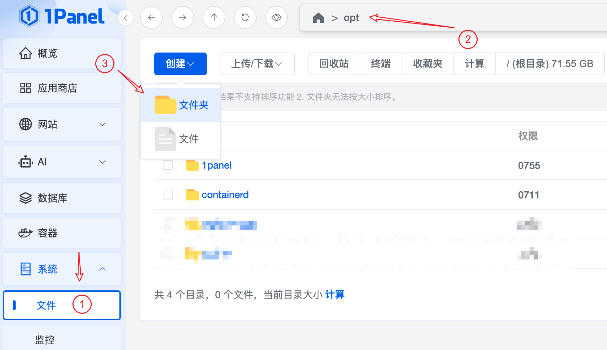
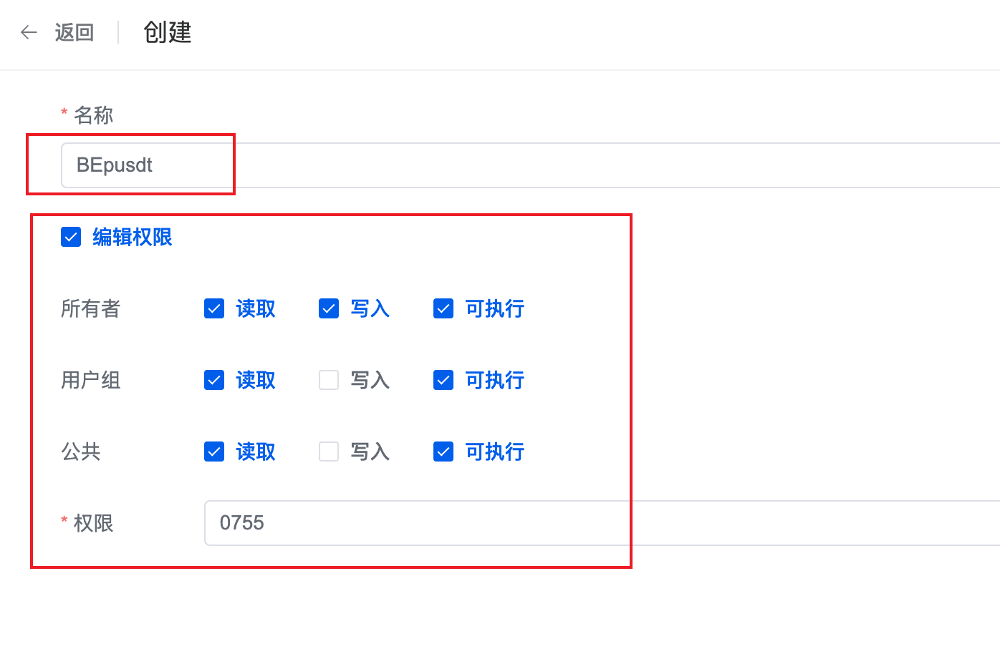

建立路径`/opt/BEpusdt`文件夹，注意权限。

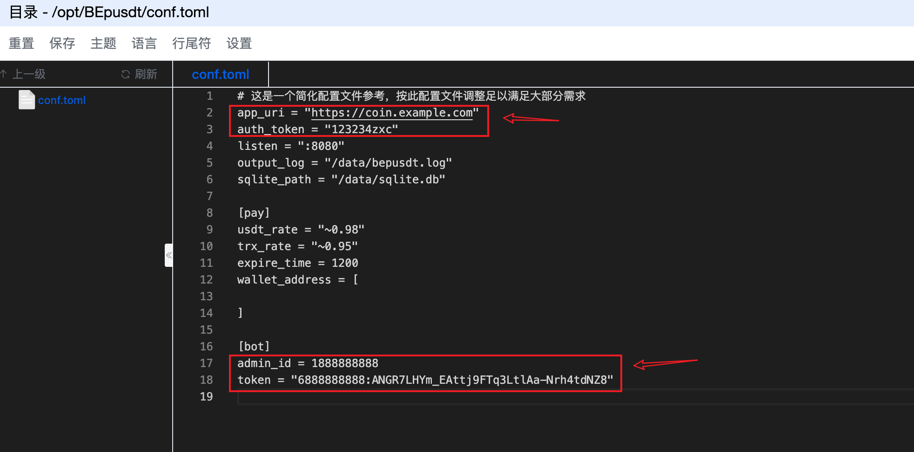

准备配置文件 https://github.com/v03413/BEpusdt/raw/main/conf.simple.toml 将此文件下载后重命名为 `conf.toml`，随后上传到
`/opt/BEpusdt` 文件夹中；图中方框特别标记的内容必须修改，其它内容按需调整。

## 创建启动 BEpusdt 容器

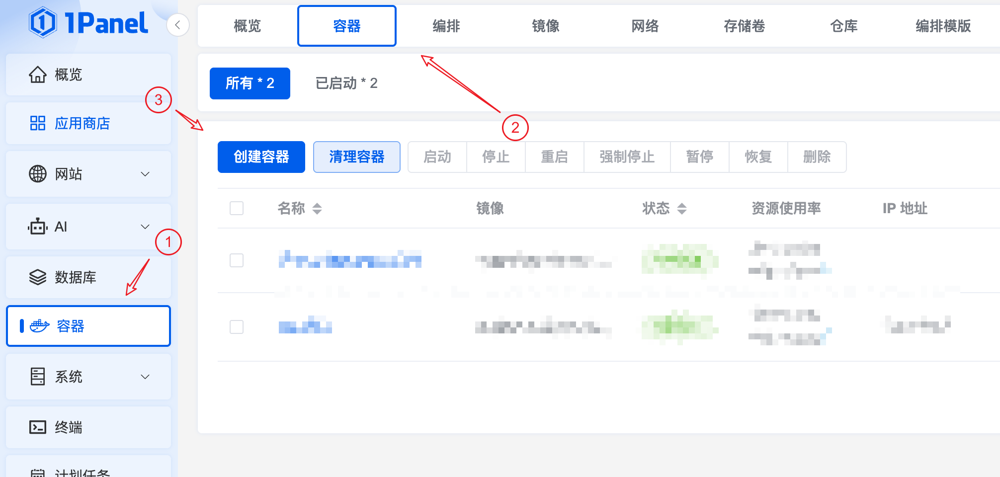
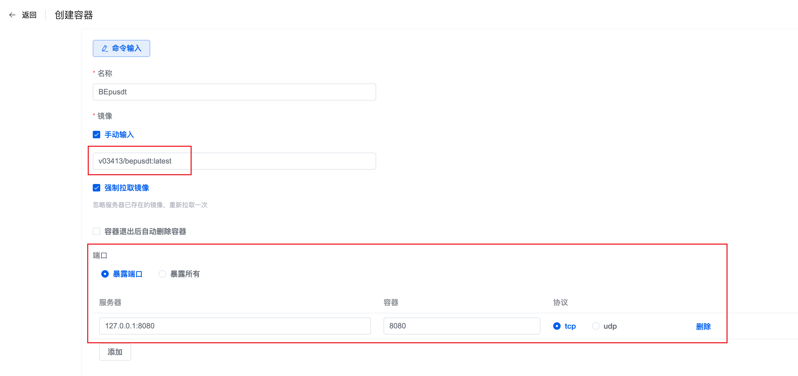

按流程进入Docker容器创建页面，镜像和端口务必按图修改，`v03413/bepusdt:latest`，其它勾选按图操作。

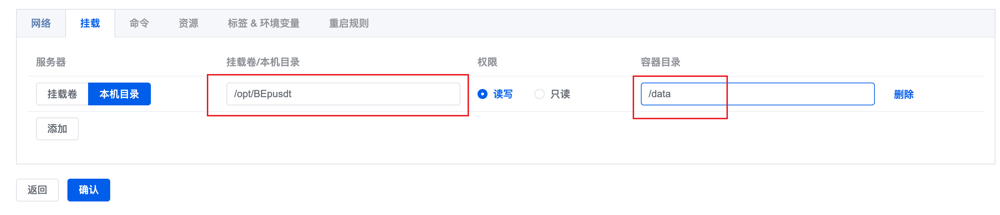  
容器挂载：本机目录 `/opt/BEpusdt` 权限：读写 `/data`

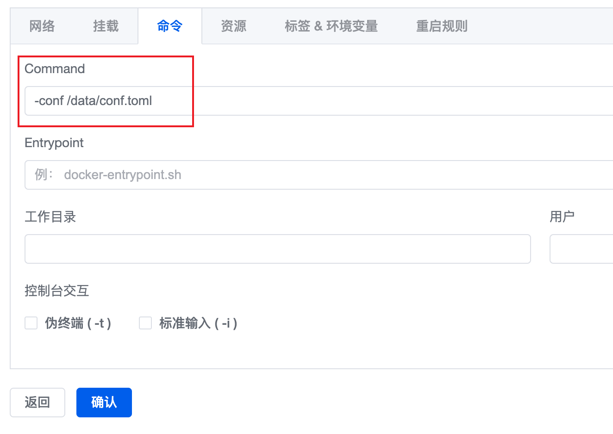  
命令：Command `-conf /data/conf.toml` 其它不填。

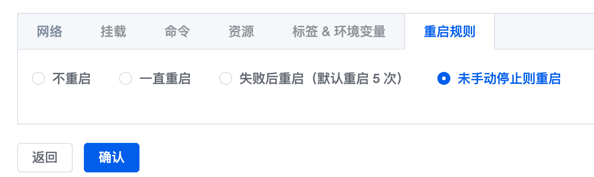  
重启规则：按图勾选第四个，**未手动停止则重启**

仔细检查，保证填写无误之后点击确认，正式创建容器；稍等片刻，等待容器部署完成。
--- 

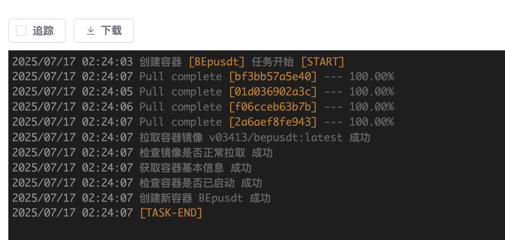
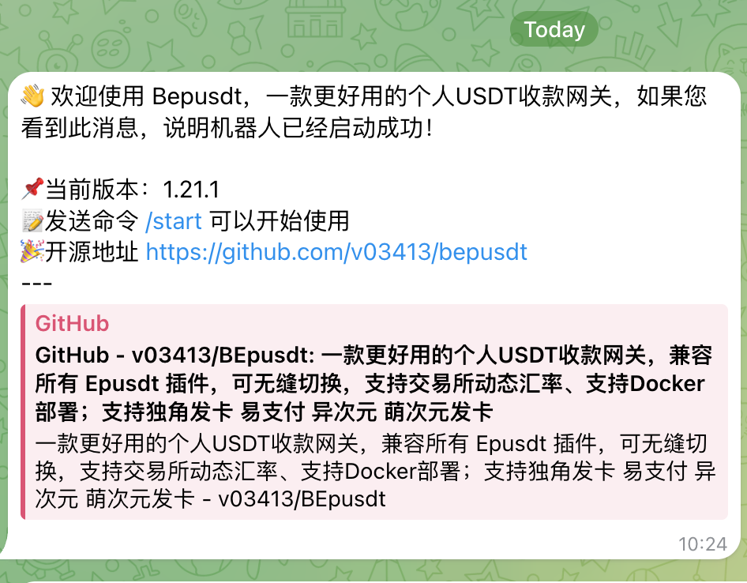

如果没发生什么错误，随后查看容器日志，如果Telegram Bot 同样收到启动消息，则说明BEpusdt部署成功。

## 建立网站 配置反代

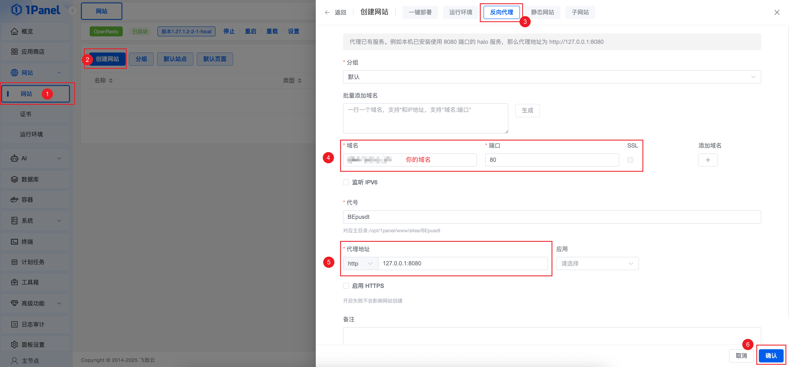

按图一步一步对应操作，如果提示没有安装`OpenResty`请自行安装；确保填写域名和代理地址正确无误，最后点击确认创建网站；
如果域名已经解析到服务器IP地址，这个时候访问你的域名能正确打开即代表反向代理成功；如果有必要推荐启用HTTPS，步骤这里不再阐述。