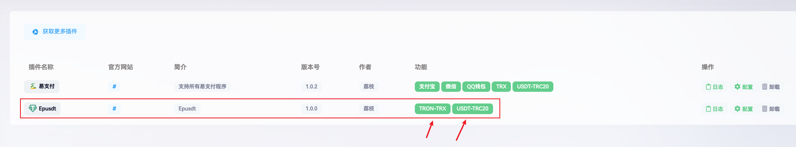
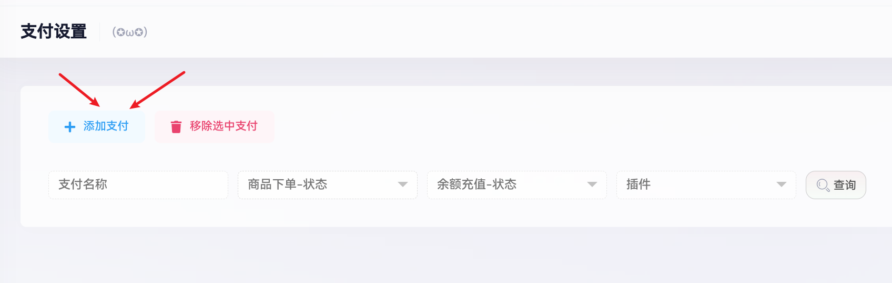
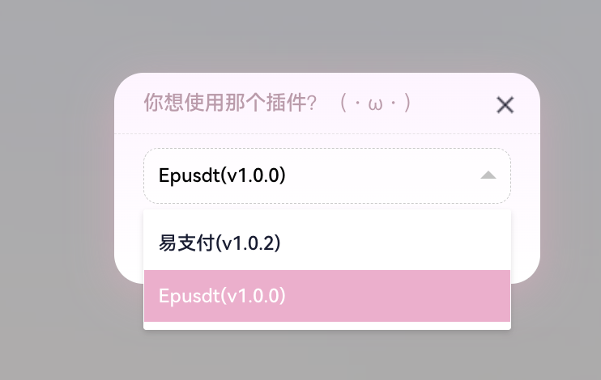
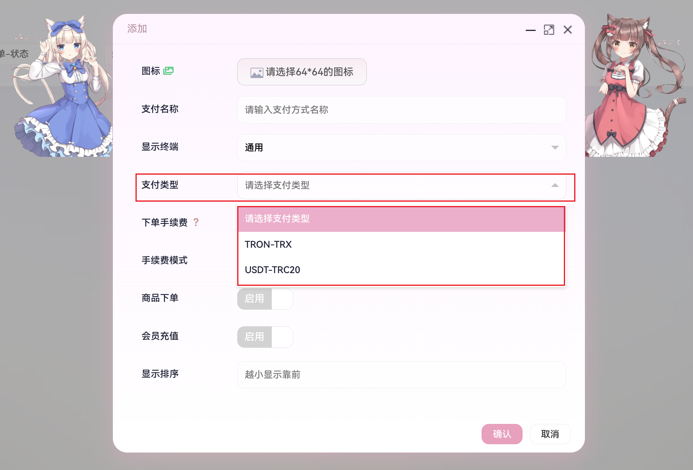

# 异次元发卡对接教程

异次元发卡开源地址：https://github.com/lizhipay/acg-faka
后台插件实际支持epusdt，但存在一些问题，这里做了一些修复并且增加了对TRX的支持，修复兼容版下载地址：[点击下载](https://raw.githubusercontent.com/v03413/bepusdt/refs/heads/main/docs/acg-faka/Epusdt.zip)

## 对接教程

### 1. 插件替换

如果已经安装了原版epusdt插件，请先卸载删除原版插件，然后将下载的修复兼容版解压上传到异次元网站跟目录`app/Pay`，
最后确保插件目录结构如下：

```
├── Epusdt
│   ├── Config
│   │   ├── Config.php
│   │   ├── Info.php
│   │   └── Submit.php
│   └── Impl
│       ├── Pay.php
│       └── Signature.php
```

⚠️ 注意：请确保插件整个目录的权限为`www:www`(一般都是这个)，如果不是请自行修改，否则无法正常使用。

返回异次元后台，点击`支付插件`，如果发现以下如图所示，说明插件安装成功。


### 2. 插件配置

- 支付网关：必须`http(s)://`开头，斜杠`/`结尾
- 密钥：搭建`Bepusdt`时候的参数`AUTH_TOKEN`


找到插件，点击右侧的`配置`按钮，填写好相关参数，点击`确认`保存即可。

### 3. 添加支付

#### 添加支付

异次元后台 -> 支付接口 -> 添加支付 -> 选择`Epusdt`




#### 支付配置



如上图所示，重点就是`支付类型`，按你的需求选择`USDT-TRC20`或者`TRON-TRX`，其他参数按照实际情况填写即可。