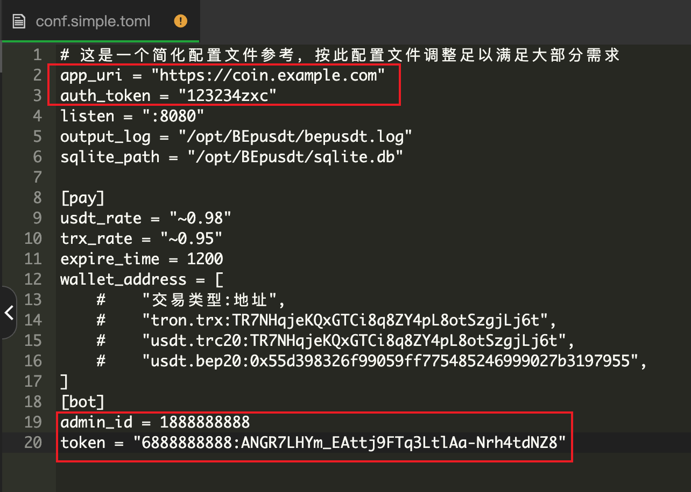
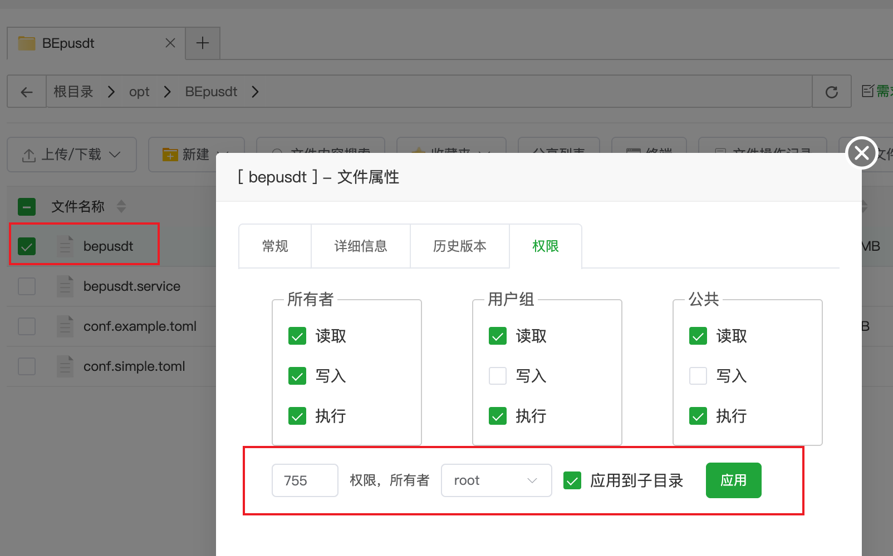
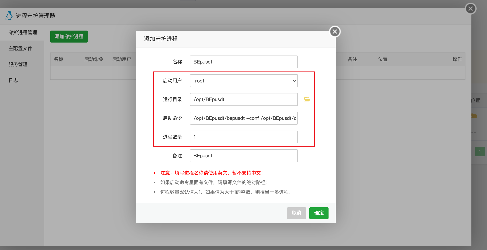
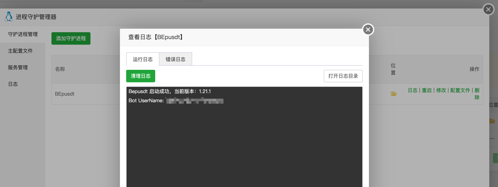
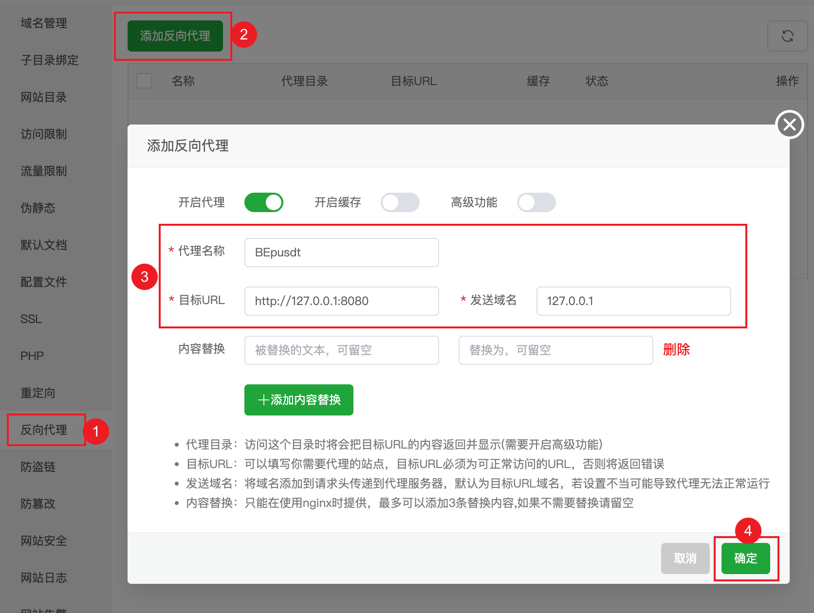

# 宝塔部署 BEpusdt 教程

> 前言：曾经我也是忠实的宝塔用户，至少7.7版本之前是；现在明确不推荐BEpusdt用户使用此面板，
> 哪怕你是用[1Panel](https://github.com/1Panel-dev/1Panel) 也行。作为一款以“开源”起家的面板，现如今连社区版用户竟然也需要强绑账号，其存在的加密模块以及屡次的安全问题这里不再重提。

教程开始，默认你已经成功安装宝塔面板。

## 配置文件准备

文件：https://github.com/v03413/BEpusdt/releases/latest/download/linux-amd64-BEpusdt.tar.gz 下载解压，将文件夹重命名为
`BEpusdt`，然后将其上传到服务器的 `/opt` 目录下。

  
打开配置文件`conf.simple.toml`进行调整，红框所示内容必须修改，同时最好增加指定日志和数据文件路径。

```toml
output_log = "/opt/BEpusdt/bepusdt.log"
sqlite_path = "/opt/BEpusdt/sqlite.db"
```

  
确保二进制文件`bepusdt`拥有如图权限。

## 配置进程守护

宝塔应用商店中搜索`进程守护管理器`，安装后进入应用，随后添加守护进程。  


运行目录：`/opt/BEpusdt`  
启动命令：`/opt/BEpusdt/bepusdt -conf /opt/BEpusdt/conf.simple.toml`

   
确认添加，随后查看日志如图，即代表部署启动成功，bot也会收到启动消息。

## 配置反向代理

宝塔面板 -> 添加站点(PHP版本: 纯静态)，随后配置添加一个反向代理，如图：  


添加之间后确保域名解析成功，访问你的域名，如果能正确打开即代表反向代理成功，推荐启用HTTPS，方法这里不再阐述。  