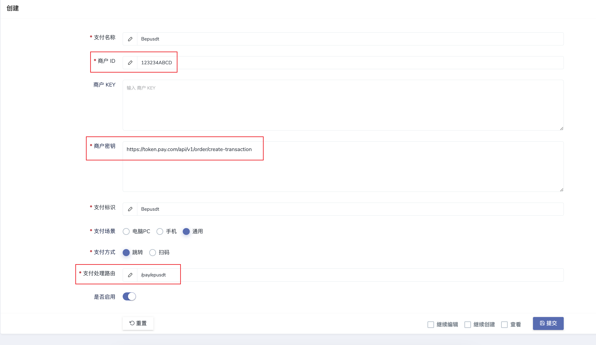

# 独角数卡对接教程

确保`Bepusdt`已经安装成功，独角数卡后台原生支持对接，按照以下图片格式填写：
> 独角后台 -> 支付配置 -> 新增
>

**重点说下几个参数：**

- 商户ID：搭建`Bepusdt`时候的参数`AUTH_TOKEN`
- 商户密钥：固定格式为`https://token.pay.com/api/v1/order/create-transaction` ，域名请自行替换
- 支付处理路由：固定填写`/pay/epusdt`

其它参数按照实际情况填写保存，即可完成对接。