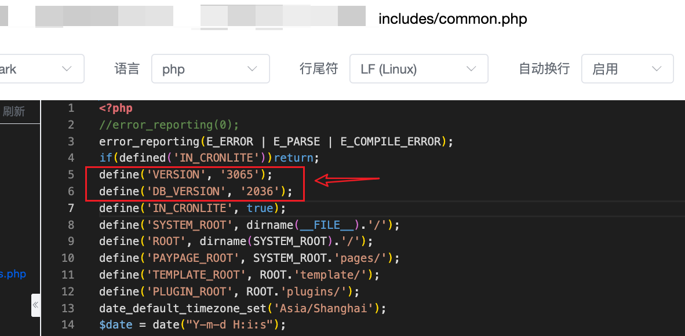
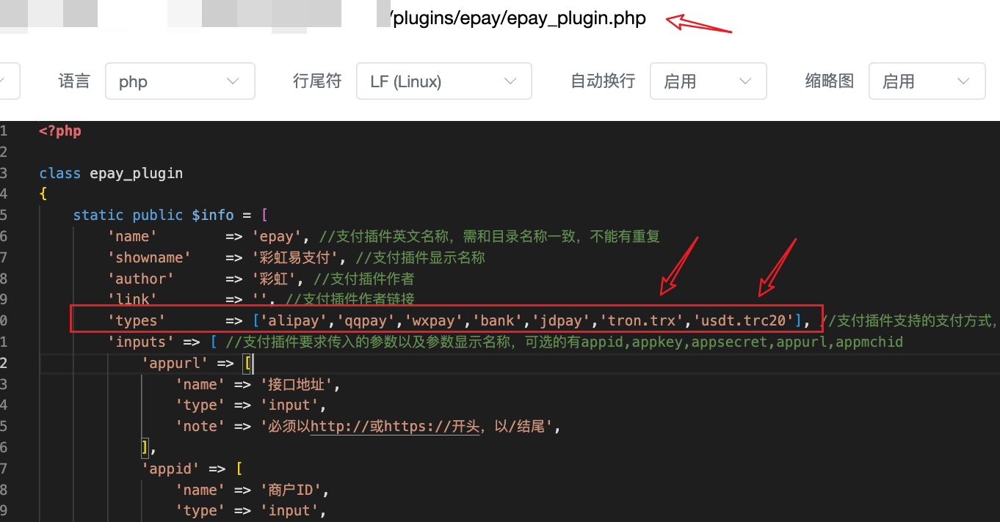
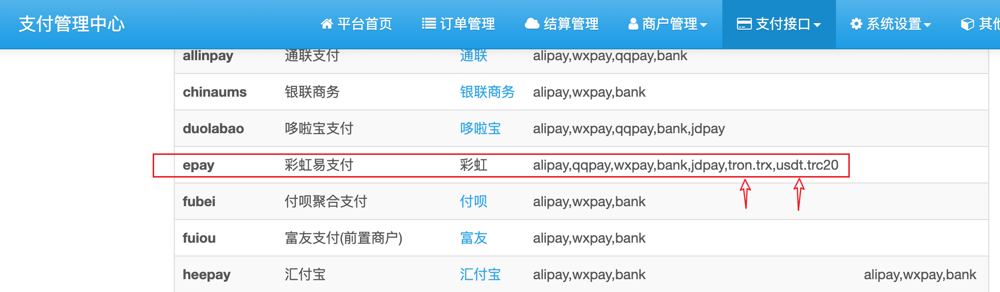
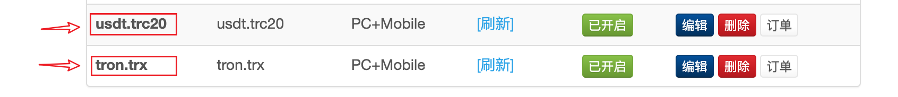
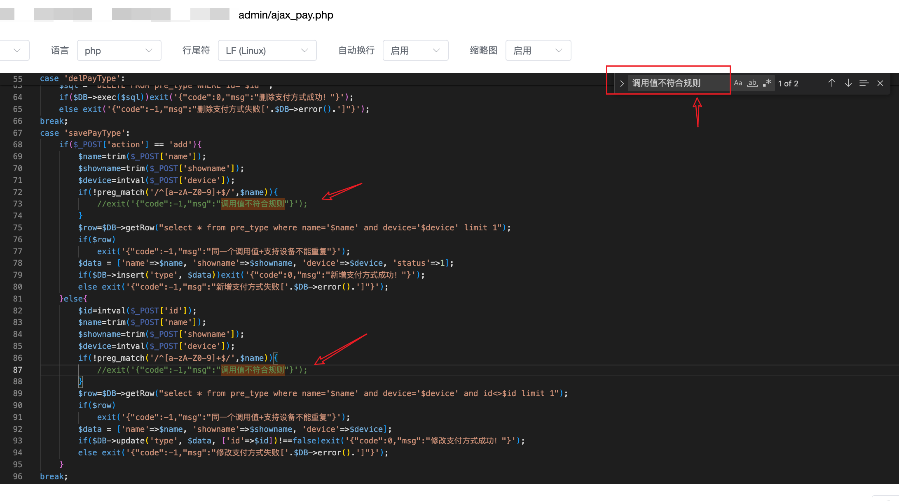
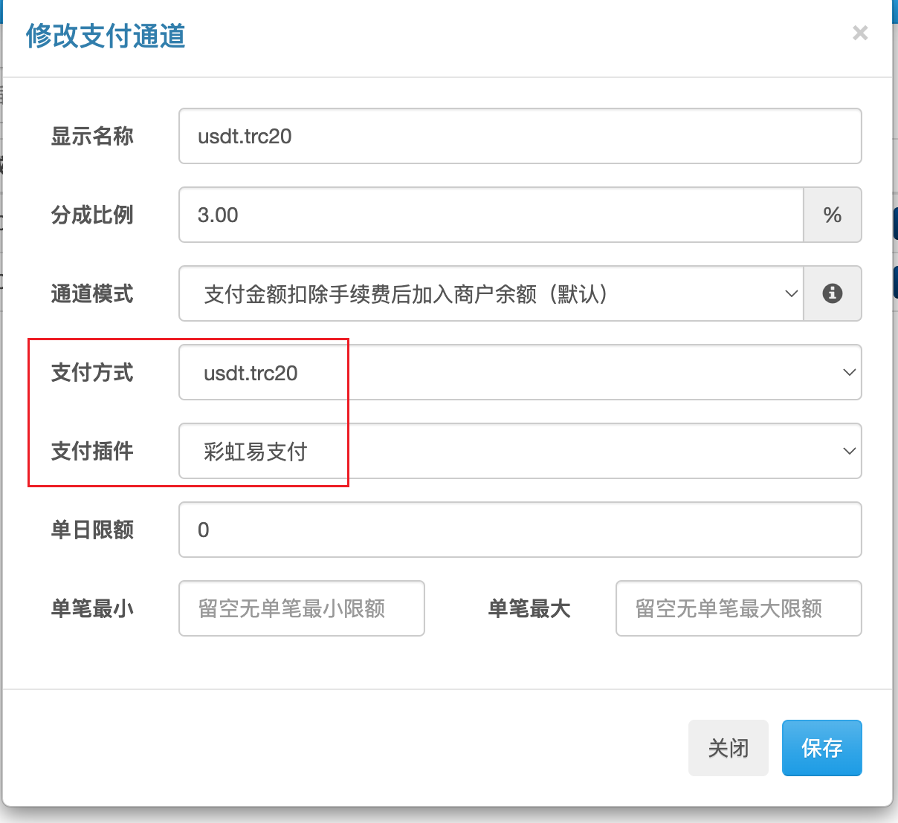
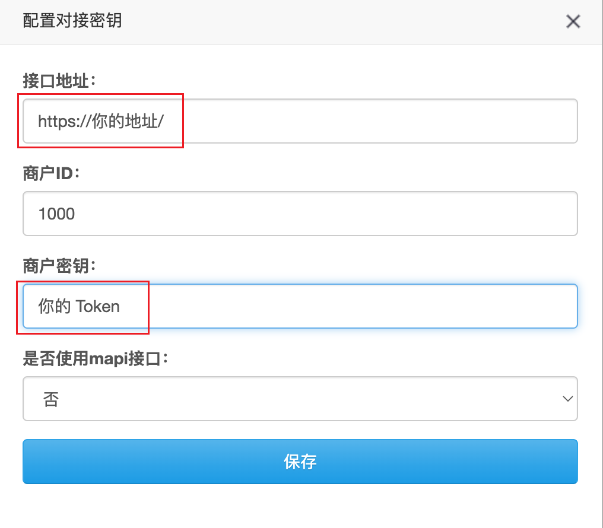

# 彩虹易支付对接教程

从版本号`v1.14.0`开始，Bepusdt开始原生支持易支付对接，没有三方插件依赖，可直接对接使用；目前网上流传的易支付改版很多，可能做不到100%兼容，有问题可以issue反馈。

本教程测试的易支付版本号，如下：

其它版本的易支付，可能会有一些不同，但是大体上是一样。

## 对接教程

### 1. 增加支付方式

找到易支付自带的原生插件文件，增加两种支付方式 `tron.trx`和`usdt.trc20`，照着下图改。

改外后回到后台，支付插件刷新，找到易支付插件，确保支付方式添加成功，如图：  

增加支付方式：`后台` -> `支付方式` -> `新增`，必须确保`调用值`与下图完全一致：

如果保存提示`调用值不符合规则`，请找到下图文件的两行代码临时注释掉，保存后再取消注释即可。

### 2. 增加支付通道

`后台` -> `支付通道` -> `新增`，参考如图：

支付方式选择刚才添加的其中一种，插件选择彩虹易支付，其它参数自行调整，最后保存。

配置密钥，如图，按照自己的情况填写：

最后保存，然后就可以开始测试是否可以正常支付了。

---  
