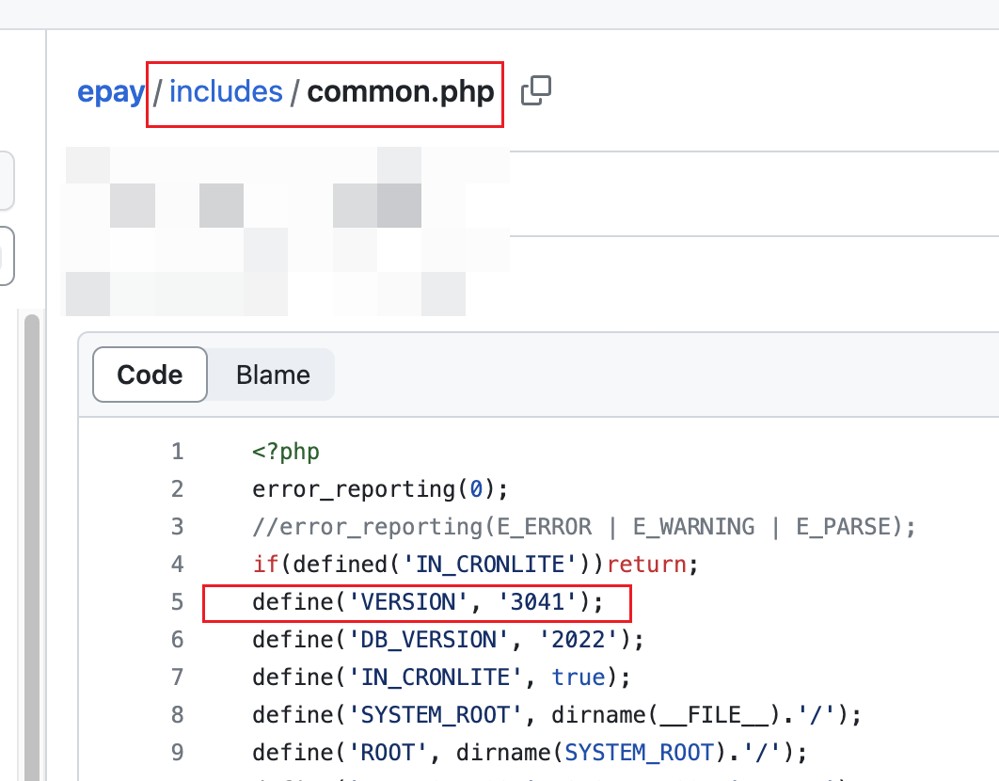

# 彩虹易支付对接教程

彩虹易支付是一个不少人都在使用的第三方聚合支付平台，本教程将会教你易支付如何对接Bepusdt。
当然在对接之前，你肯定先要搭建好对应的易支付网站和Bepusdt，相关教程此文档里面不再赘述。

注意：本教程针对的易支付版本是`3041`
,其它版本的不做保证，虽然大概率并没差别；如何查看易支付版本，源码文件`includes/common.php`，打开之后如图所示：

OK，现在假设你所有准备工作都已经准备好了且运行正常，步骤开始：

## 操作步骤

1. 进入易支付后台，新增一种支付方式，调用值必须设置为usdt，显示名称无所谓，支持设备选PC+Mobile。
2. 进入易支付源码插件目录`plugins`，创建目录`bepusdt`(不能改名)，再将[此插件文件](../plugins/epay/bepusdt_plugin.php)
   原封不动的上传到刚才创建的`bepusdt`目录。
3. 进入易支付后台，刷新支付插件之后便能看到一个`bepusdt`收款插件，随后按照正常流程，配置接口地址和Token添加支付通道启用即可。
