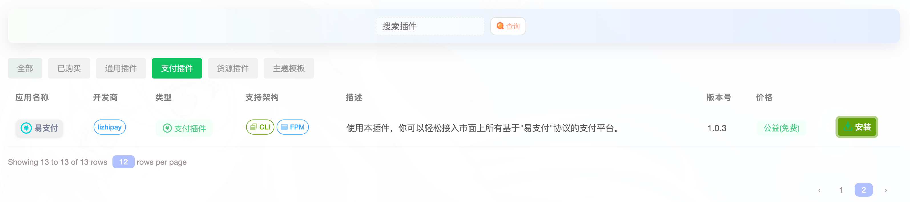
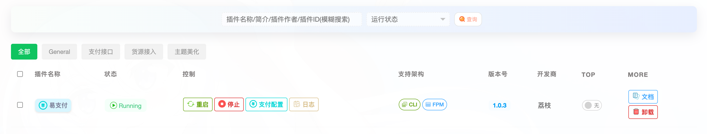
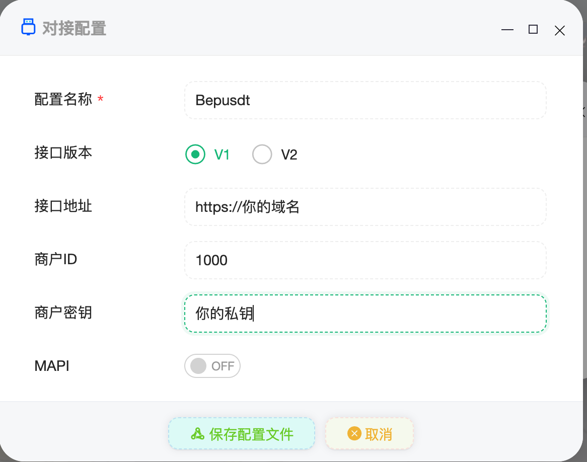
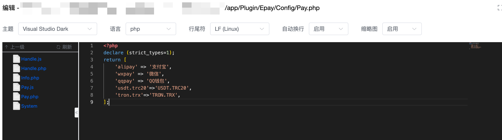
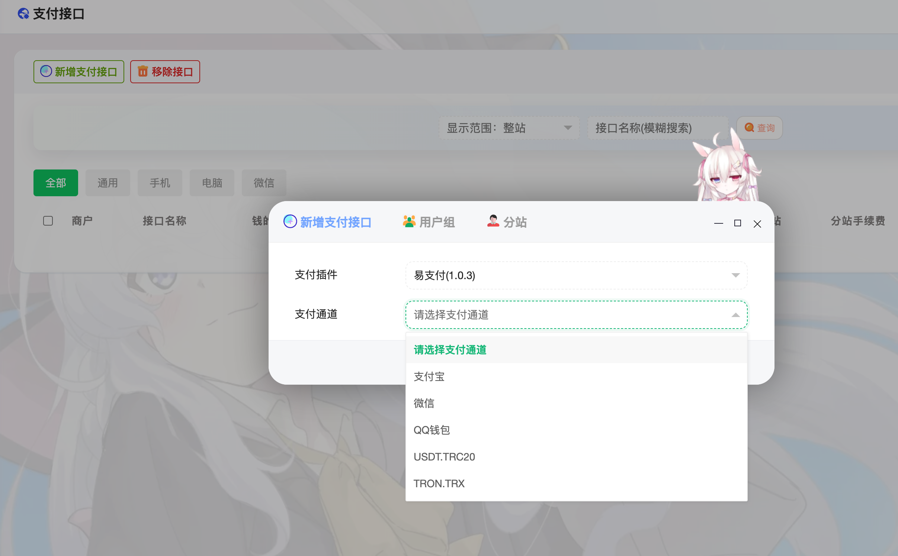
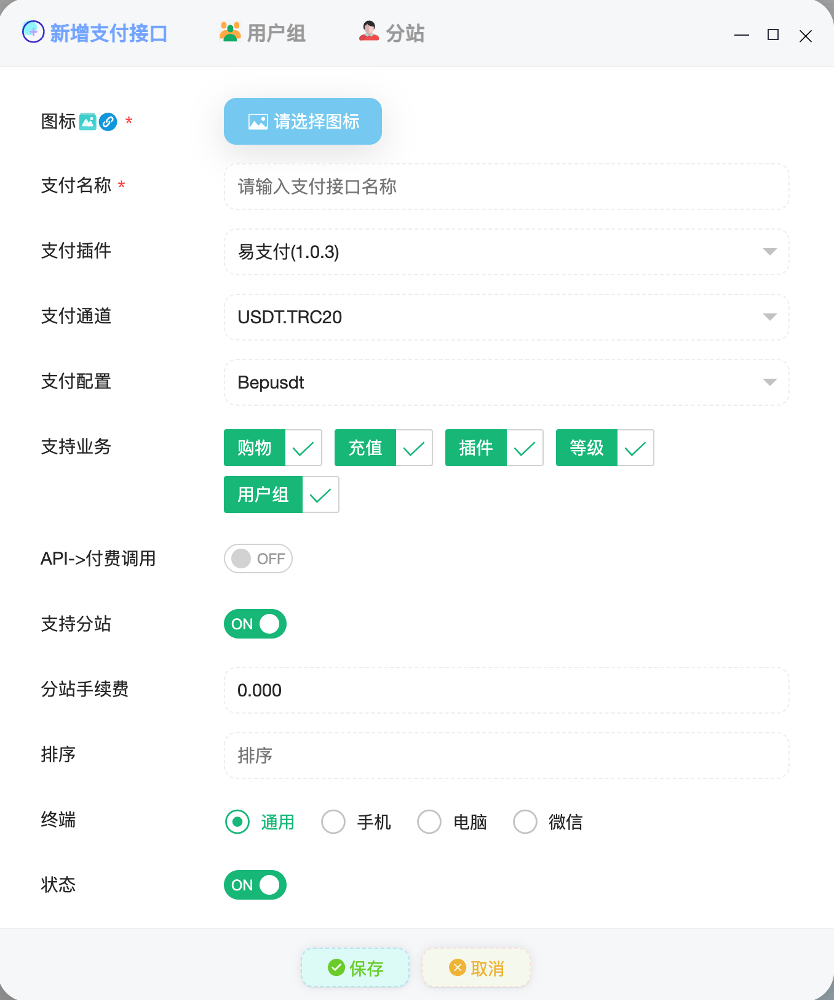

# 萌次元商城系统对接教程

原本以为萌次元会和异次元一样适配至少`epusdt`一个插件，哪怕根本用不了；应用商店倒是存在一个`TRC20-USDT`收费插件。  
说回正题，萌次元并没对`epusdt`适配，但不影响，`Bepusdt`兼容易支付接口，同样可以顺利接入。

## 对接教程

### 1.安装易支付插件并启用

> 路径：后台 -> 插件管理 -> 应用商店 -> 支付插件 -> 易支付

找到这个插件，并把他安装下来，随后启用。

### 2.支付配置

点击添加配置，配置自己的`Bepusdt`信息，参考如下：

### 3.增加支付通道

原版易支付不支持`usdt`和`trx`
，需有对原版代码进行替换；请把这个文件[Pay.php](https://raw.githubusercontent.com/v03413/bepusdt/refs/heads/main/docs/mcy-shop/Pay.php)
下载下来，替换到你的网站路径`/app/Plugin/Epay/Config`下的同名文件。

### 4.增加支付接口

> 路径：网站后台 -> 支付接口 -> 新增支付接口   
> 插件选择：易支付  
> 支付通道：自行选择    
> 支付配置：选择第二步添加的配置
>

其它参数根据自己的需求填写即可，填好之后即可开始测试是否对接成功！