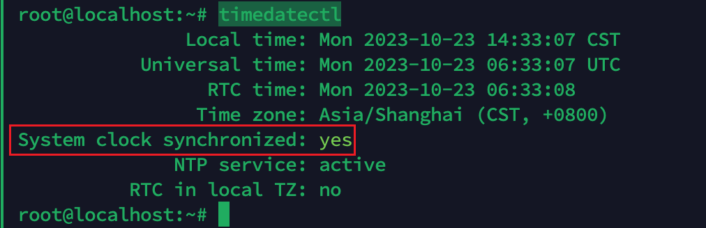

# 时间同步

判断一个支付是否完成，主要依赖的就是判断某个交易金额是否在指定时间范围内发生，所以时间同步的重要性不言而喻。

这里给出一个Debian11+打开时钟同步的简单方法，其他系统自行参考。

## Debian11+

```bash

# root 权限执行
apt update && apt install systemd-timesyncd -y 
systemctl enable systemd-timesyncd.service && systemctl start systemd-timesyncd.service

# 查看同步状态
systemctl status systemd-timesyncd.service
```

最后再执行`timedatectl`，检查时间看看系统时钟同步是否打开，如图所示即说明成功。
